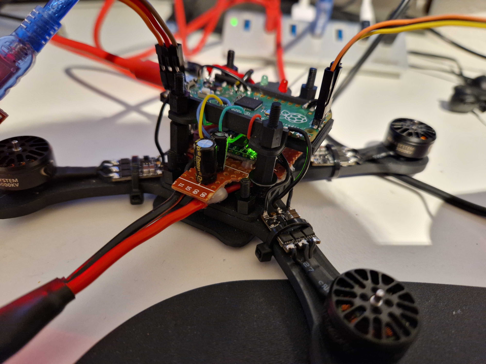
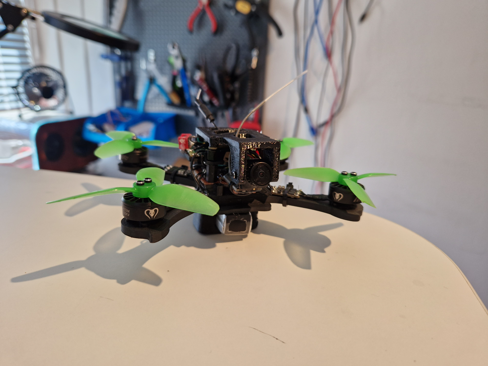
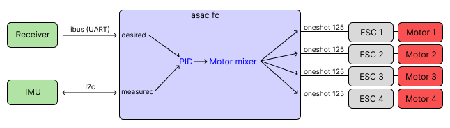
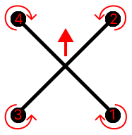

# ASAC FC

**A** **S**imple **A**nd **C**ool **F**light **C**ontroller (ASAC FC) is a flight controller based on the rp2040 microcontroller, completely open-source.


## Why rp2040?
It's an incredibly cheap microcontroller that is quite powerful (up to 133 MHz), contains two cores, programmable I/O pins (PIO), seems to ignore the global silicon shortage and has an extensive C/C++ SDK.

The first iteration of *asac fc* was done with development boards, before designing a custom PCB. This is to make a proof of concept, and serves as a sanity check to show that it's possible :). The main components are:
- **Raspberry pi pico** - Flight controller (where asac runs)
- **MPU6050** - IMU
- **FS-a8s** - Radio receiver (Flysky, outputs IBUS)
- **xsd7a ESC** - ESCs (Single motor ESCs, so 4 in total)
- **Frame** - Custom designed, 3D-printed in PLA.

I created a simple power distribution board (brown part, at the bottom of the drone in the picture below), where the battery is connected to. Each ESC as well as the pico and the receiver gets its power from this board. The ESCs are then connected to GPIOs on the pico.



After some manual (headless) flights, I decided to add an analog camera together with a VTX I had laying around. This way, we can fly some FPV with the pico!




## From receiver input to motor outputs



In order to set the correct speeds for each motor, several steps must be taken. The steps described below is how it's done for *asac fc*. Note that this is for acro mode only (freestyle, using only gyro rates from IMU).

1. Read gyro rates from IMU
2. Remove bias from gyro reading
3. Filter gyro reading
4. Read receiver input
5. Convert receiver stick inputs to desired gyro rates. This is a mapping from eg. 1000-2000 -> -500 to 500 deg/s.
6. Give the *desired* rates together with the *measured* rates to PID controller that uses PID parameters to calculate adjustment values.
7. Give output from PID controller to motor mixer to get commands for each motor.
8. Send the motor outputs to the ESC(s).

## RTOS
*asac fc* uses a very simple RTOS called [vsrtos](https://github.com/victorhook/vsrtos), that uses a priority based non-preemptive scheduling technique to run tasks. While this rtos is quite immature, it works just fine for this application, since *asac fc* doesn't have that many tasks yet.

## Motor mixing

The motor mixer is responsible for deciding which motor should spin and how much. *asac fc* uses the default motor numbers like in the image below, which is the same as the default for betaflight.



The default motor mix is:

| Motor | Throttle | Roll | Pitch | Yaw |
| --- | --- | --- | --- | --- |
| 1 | 1 | -1 | 1  | -1 |
| 2 | 1 | -1 | -1 | 1  |
| 3 | 1 | 1  | 1  | 1 |
| 4 | 1 | 1  | -1 | -1  |


## Flashing

You can flash the pico through in three different ways:
1. Through USB, when it's connected as a USB device (press down button while powering the pico)
2. Through serial USB by utilizing the picotool:
   `picotool load -f target.uf2 && picotool reboot -f`
    This works if uart 0 is mapped to USB:
    ```
    pico_enable_stdio_uart(asac-fc 0)
    pico_enable_stdio_usb(asac-fc 1)
    ```
    The command above first flashes the target `uf2` file to the pico by forcing it into BOOTSEL mode. We then reset the pico with `picotool reboot -f`. The flag `-f` is crucial here, since it allows us to load and reboot it without being in BOOTSEL mode already. I think it accomplishes this by changing the baud rate of the connection, which forces the pico to BOOTSEL mode, but I am not 100% sure.
3. SWD using debugger/another pico.

## Resources
- [Embedded Programming for Quadcopters](https://www.youtube.com/watch?v=CHSYgLfhwUo&ab_channel=Code%26Supply)
- [Motor mixing](https://oscarliang.com/custom-motor-output-mix-quadcopter/)

